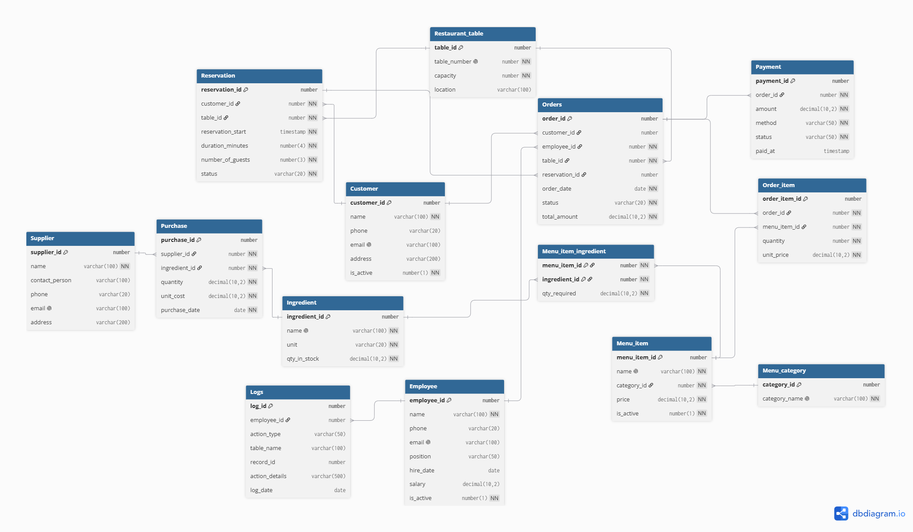
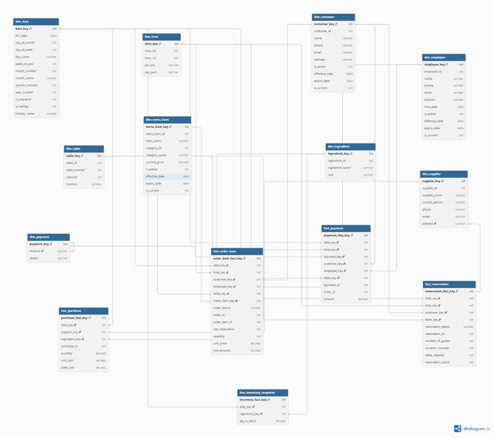

# Restaurant Database & Data Warehouse

An Oracle database for restaurant operations (customers, reservations, orders,
payments, menu, inventory, purchasing) plus a star-schema data warehouse for
sales and purchasing analytics.

IDs are assigned manually in the sample data — `GENERATED ALWAYS AS IDENTITY`
is present but commented out in `tables.sql`, ready to enable if you want
Oracle to generate them instead.

---

## Repository layout

| Path | Contents |
|---|---|
| `database/tables.sql` | OLTP schema: 14 tables, constraints, FK relationships |
| `database/sample_data.sql` | Demo data, loaded through the real triggers |
| `procedures/functions.sql` | `CalculateOrderTotal`, `GetCustomerVisitCount` |
| `procedures/procedures.sql` | `GetCustomerOrders`, `CreateReservation`, `ProcessPayment` |
| `procedures/triggers.sql` | 3 triggers (inventory deduction, price audit, running order total) |
| `data_warehouse/warehouse.sql` | Star schema design (DBML, for dbdiagram.io) |
| `data_warehouse/analytical_queries.sql` | Reporting queries against the warehouse *(currently empty)* |
| `ERD/restaurant_erp_database_erd.png` | OLTP entity relationship diagram |
| `report/report.pdf` | Project write-up *(currently empty)* |
| `run_all.sql` | Master script — builds everything in order |

---

## OLTP entity relationship diagram



## Setup (SQL*Plus or SQLcl, in this order)

```sql
@database/tables.sql
@procedures/functions.sql
@procedures/procedures.sql
@procedures/triggers.sql
@database/sample_data.sql
```

Or simply:

```bash
sqlplus user/pass@db @run_all.sql
```

Triggers must exist **before** the sample data loads: `Orders.total_amount`
is filled in incrementally by `trg_order_total` as `Order_item` rows are
inserted, so orders are seeded at `0` and the trigger does the rest.

`data_warehouse/warehouse.sql` is DBML, not executable SQL — paste it into
[dbdiagram.io](https://dbdiagram.io) to view or edit the diagram. It isn't
run by `run_all.sql`, and `analytical_queries.sql` is still empty.

---

## Design decisions

- **Status over deletion.** Orders are cancelled rather than removed;
  customers and menu items are deactivated (`is_active`) rather than deleted,
  so payment and order history stay intact.
- **Order lifecycle:** `OPEN` → `CLOSED` (fully paid) or `CANCELLED`.
- **Inventory is trigger-driven:** `trg_inventory_update` deducts stock when
  an order line is inserted, and blocks the insert with a clear error if
  stock would go negative.
- **Concurrency:** `CreateReservation` locks the table row and rejects
  overlapping time windows (a partial unique index, `uq_res_active_slot`,
  backs this up at the constraint level). `ProcessPayment` locks the order
  row before checking the remaining balance.
- **Single source of truth for money:** `Orders.total_amount` is maintained
  by `trg_order_total`, not computed by the application; payments are
  checked against it in `ProcessPayment`.
- **Audit trail:** `trg_price_audit` logs every `Menu_item.price` change to
  the `Logs` table.

---

## Error codes

| Code | Meaning |
|---|---|
| -20001 | Number of guests exceeds table capacity (`CreateReservation`) |
| -20002 | Table is already reserved for an overlapping time window (`CreateReservation`) |
| -20003 | Payment exceeds the order's remaining balance (`ProcessPayment`) |
| -20004 | Order is not `OPEN`, so it can't accept a payment (`ProcessPayment`) |

---

## Data warehouse

Star schema for reporting: five fact tables at different grains
(`fact_order_item`, `fact_payment`, `fact_reservation`, `fact_purchase`,
`fact_inventory_snapshot`), surrounded by conformed dimensions
(`dim_date`, `dim_time`, `dim_customer`, `dim_employee`, `dim_table`,
`dim_menu_item`, `dim_ingredient`, `dim_supplier`, `dim_payment`).
`dim_customer`, `dim_employee`, and `dim_menu_item` track history with
SCD Type 2 columns (`effective_date`, `expiry_date`, `is_current`).



---

## Contributors

<table align="center">
  <tr>
    <td align="center">
      <a href="https://github.com/Usf132">
        <br />
        <sub><b>Usf132</b></sub>
      </a>
    </td>
    <td align="center">
      <a href="https://github.com/MariamAbdelaziz21">
        <br />
        <sub><b>MariamAbdelaziz21</b></sub>
      </a>
    </td>
    <td align="center">
      <a href="https://github.com/ran-da25">
        <br />
        <sub><b>ran-da25</b></sub>
      </a>
    </td>
    <td align="center">
      <a href="https://github.com/Abanob-Ayman">
        <br />
        <sub><b>Abanob-Ayman</b></sub>
      </a>
    </td>
  </tr>
</table>

---

## License

MIT — see [`LICENSE`](./LICENSE).
